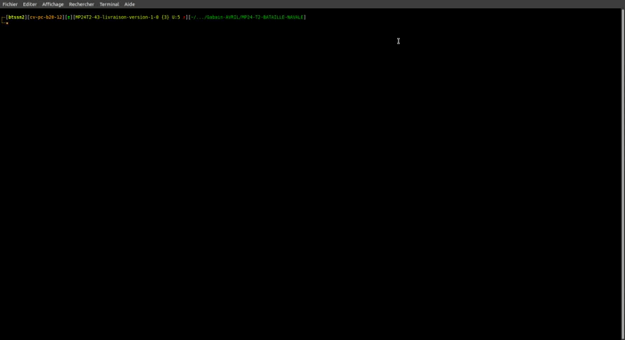
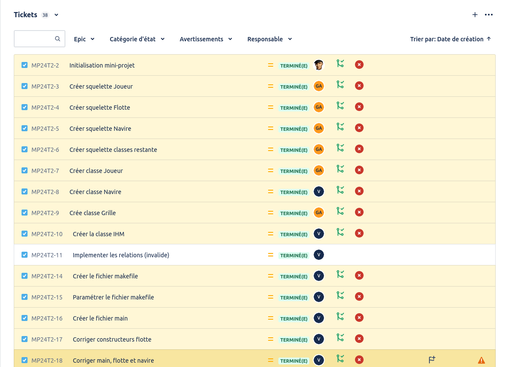
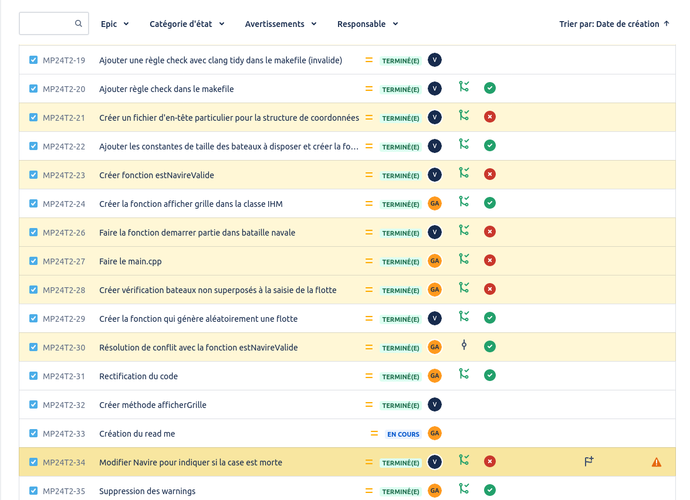
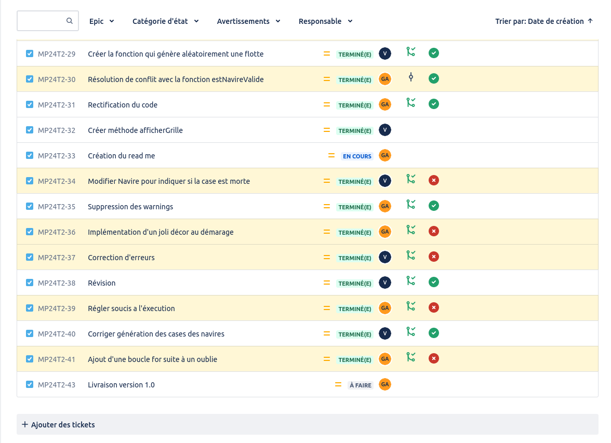
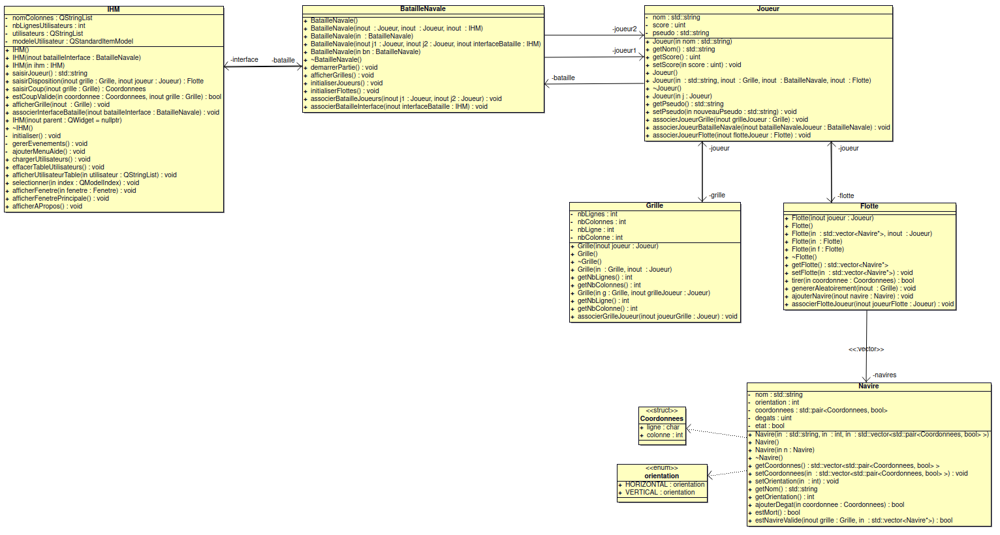

[](https://github.com/btssn-lasalle-84/MP24-T2-BATAILLE-NAVALE/actions/workflows/c-cpp.yml)[](https://github.com/btssn-lasalle-84/MP24-T2-BATAILLE-NAVALE/actions/workflows/cppformat.yml)

# Mini-Projet Bataille Navale

## Informations

- Nom du logiciel : Bataille Navale
- Date de début : 22 Novembre 2023
- Numéro de version du logiciel : 1.0
- Date de cette version du logiciel : 20 Décembre 2023

## Présentation + Objectifs

Ce mini-projet a pour but de re-créer le jeu de société : Bataille Navale en POO/C++. Le but est de jouer une partie contre une machine qui pourrait s'apparenter à un humain.  Le joueur pourra placer ses bateaux via l'interface, en entrant l'orientation et les coordonnées de la proue des bateaux. Après le placement terminé, le joueur pourra entrer les coordonnées de la case à attaquer adverse. Une fois tous les bateaux adverses détruit, le joueur sera désigné comme gagnant, à moins que la machine y arrive avant lui.
## Utilisation

Exemple :

```bash
$ make

$ ./batailleNavale.out
```

## Ce que le logiciel fait dans cette version
### Version 1.0

Dans cette version, le programme est capable de : 

[X]  Saisir le nom d'un joueur

[X]  Créer une flotte pour le joueur

[X]  Placer les bateaux de la machine aléatoirement

[X]  Afficher les deux grilles en jeu avec les bateaux positionnés

[X]  Saisir un coup sur la grille



## TODO

### Pour la version 2.0 

[ ]  Gérer les dégâts causés aux bateaux

[ ]  Gérer les essais réalisés par le joueur (loupés, touchés et coulés)

[ ]  Afficher le déroulement d’une partie (grille, essais du joueur, ...)

[ ]  Jouer une partie


## Défauts constatés non corrigés

## Itérations





## Diagramme de classes



## Équipe de développement

- Enzo VALOBRA : valobra.enzo@gmail.com
- Gabain AVRIL : gabain.avril@gmail.com

---
&copy; 2023 LaSalle Avignon